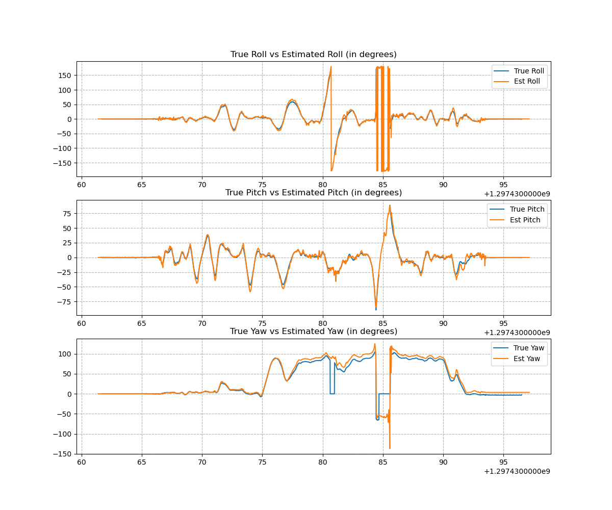

## Project Structure
<pre>
├── README.md
├── code
│   ├── jax_orientation_tracking.ipynb
│   ├── load_data.py
│   ├── orientation_tracking.ipynb
│   ├── orientation_tracking.py
│   ├── panorama_stitching.py
│   ├── plot_code.py
│   ├── rotplot.py
│   └── utils.py
├── data
│   ├── testset
│   └── trainset
├── docs
│   ├── IMU_reference.pdf
│   ├── IMUandCamSensors.jpg
│   ├── accelerometer_datasheet_adxl335.pdf
│   ├── gyroscope_pitch_roll_datasheet_lpr530al.pdf
│   └── gyroscope_yaw_datasheet_ly530alh.pdf
├── plots
│   ├── orientation_tracking
│   │   ├── dataset_1
│   │   ├── dataset_10
│   │   ├── dataset_11
│   │   ├── dataset_2
│   │   ├── dataset_3
│   │   ├── dataset_4
│   │   ├── dataset_5
│   │   ├── dataset_6
│   │   ├── dataset_7
│   │   ├── dataset_8
│   │   └── dataset_9
│   └── panorama_stitching
├── problem_statement.pdf
├── report
│   └── Orientation_Tracking_report.pdf
└── requirements.txt
</pre>

## Technical Report
* [Saqib Azim. "Orientation Tracking and Panorama Stitching" January 2023](report/Orientation_Tracking_report.pdf)

## To run the orientation tracking code
```
cd code/ | python3 orientation_tracking.py --dataset_idx=<integer between 1-11>
```
- Optimized IMU orientations are stored in numpy format at `data/ckpt_weights/dataset/`
- Plots and Figures are stored in `plots/orientation_tracking/dataset/`

## To run the panorama stitching code
```
cd code/ | python3 panorama_stitching.py --dataset_idx=<integer between 1-11>
```

- Stitched Images are stored in `plots/panorama_stitching/`

## Results

### Orientation Tracking
### Dataset 1
<p align ="center">
   
   
</p>

### Dataset 7
<p align ="center">
   
   
</p>

### Panorama Stitching
### Dataset 1
<p align ="center">
   
</p>

### Dataset 8
<p align ="center">
   
</p>
